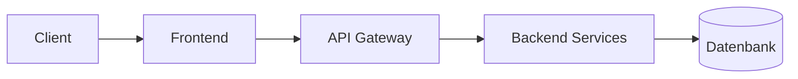
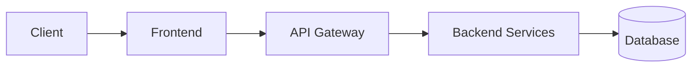

# 🚀 Antigravity Projekt-Template

Ein umfassendes Template für KI-gestützte Entwicklungsprojekte. Dieses Template bietet eine standardisierte Struktur für Agent-Konfiguration, Entwicklungscontainer und Projektdokumentation.

## 📋 Inhaltsverzeichnis

- [Warum dieses Template?](#-warum-dieses-template)
- [Erste Schritte](#-erste-schritte)
- [Projektstruktur](#-projektstruktur)
- [Die Bedeutung des Tech-Stacks](#-die-bedeutung-des-tech-stacks)
- [Architektur-Dokumentation](#-architektur-dokumentation)
- [Agent-Konfiguration (./agents/)](#-agent-konfiguration-agents)
- [DevContainers](#-devcontainers)
- [Changelog & SBOM](#-changelog--sbom)
- [Lizenz](#-lizenz)

---

## 🎯 Warum dieses Template?

Moderne KI-gestützte Entwicklung funktioniert am besten, wenn die KI den Kontext deines Projekts versteht. Dieses Template bietet:

- **Strukturierter Kontext** - Klare Dokumentation von Tech-Stack und Architektur
- **Persistenter Speicher** - Erkenntnisse und Präferenzen über Sessions hinweg
- **Konsistente Workflows** - Standardisierte Prozesse für häufige Aufgaben
- **Entwicklungscontainer** - Reproduzierbare Umgebungen für Frontend und Backend

> **Ohne den richtigen Kontext trifft die KI Annahmen. Mit diesem Template trifft sie informierte Entscheidungen.**

---

## 🏁 Erste Schritte

1. **Klone oder kopiere dieses Template** in dein neues Projekt
2. **Aktualisiere `agents/context.md`** mit deinen Projektdetails
3. **Wähle deinen Tech-Stack** und dokumentiere ihn (siehe unten)
4. **Konfiguriere DevContainers** für deine Bedürfnisse (optional)
5. **Beginne mit der Entwicklung!**

```bash
# Template klonen
git clone https://github.com/your-org/antigravity-template.git mein-projekt
cd mein-projekt

# Git-Historie entfernen und neu starten
rm -rf .git
git init
```

---

## 📁 Projektstruktur

```
projekt-root/
├── agents/                  # KI-Agent-Konfiguration (WICHTIG!)
│   ├── context.md          # Projektkontext & Tech-Stack
│   ├── memory.md           # Persistente Erkenntnisse
│   ├── rules/              # Verhaltensregeln
│   │   └── changelog-tracking.md
│   └── workflows/          # Schritt-für-Schritt-Prozesse
│       └── update-changelog.md
├── .devcontainer/          # Entwicklungscontainer (optional)
│   ├── frontend/           # Frontend-Entwicklungsumgebung
│   │   ├── devcontainer.json
│   │   └── Dockerfile
│   └── backend/            # Backend-Entwicklungsumgebung
│       ├── devcontainer.json
│       └── Dockerfile
├── frontend/               # Dein Frontend-Code (erstellen)
├── backend/                # Dein Backend-Code (erstellen)
├── changelog.md            # Projekt-Changelog
├── sbom.md                 # Software Bill of Materials
├── LICENSE                 # MIT-Lizenz
└── README.md               # Diese Datei
```

---

## 🔧 Die Bedeutung des Tech-Stacks

### Warum früh definieren?

Deine Technologie-Entscheidungen beeinflussen alles:

| Entscheidung | Auswirkung |
|--------------|------------|
| **Framework** | Entwicklungsgeschwindigkeit, Lernkurve, Ökosystem |
| **Sprache** | Typsicherheit, Performance, Developer Experience |
| **Datenbank** | Datenmodellierung, Skalierung, Query-Fähigkeiten |
| **Infrastruktur** | Kosten, Komplexität, Wartung |

### Auswahlkriterien

Berücksichtige diese Faktoren bei der Auswahl:

1. **Team-Expertise** - Was kennt dein Team?
2. **Projekt-Anforderungen** - Was braucht das Projekt?
3. **Langfristige Wartbarkeit** - Wer wartet das in 2 Jahren?
4. **Community & Ökosystem** - Gibt es gute Dokumentation und Pakete?
5. **Performance-Anforderungen** - Welche Skalierungsanforderungen gibt es?

### Dokumentiere deine Entscheidungen

Nutze `agents/context.md` um zu dokumentieren:

- **Was** du gewählt hast
- **Warum** du es gewählt hast
- **Alternativen** die du in Betracht gezogen hast
- **Trade-offs** die du akzeptiert hast

> **Beispiel**: "PostgreSQL statt MongoDB gewählt, weil wir komplexe Joins für Reports brauchen. Trade-off: weniger Flexibilität bei Schema-Änderungen."

---

## 🏗️ Architektur-Dokumentation

Gute Architektur-Dokumentation beantwortet:

### Das "Was"
- Was sind die Hauptkomponenten?
- Was macht jede Komponente?
- Wo sind die Grenzen zwischen Komponenten?

### Das "Wie"
- Wie kommunizieren Komponenten?
- Wie werden Daten gespeichert und abgerufen?
- Wie funktioniert die Authentifizierung?

### Das "Warum"
- Warum wurde diese Architektur gewählt?
- Warum nicht ein einfacherer Ansatz?
- Warum sind bestimmte Grenzen wo sie sind?

### Empfohlene Diagramme

Füge in `agents/context.md` ein:

1. **High-Level Systemdiagramm** - Zeigt alle Hauptkomponenten
2. **Datenfluss-Diagramm** - Zeigt wie Daten durch das System fließen
3. **Deployment-Diagramm** - Zeigt die Infrastruktur



---

## 🤖 Agent-Konfiguration (./agents/)

> [!IMPORTANT]
> **Der `agents/`-Ordner ist das Herzstück dieses Templates.** Er enthält alles, was KI-Agenten brauchen, um dein Projekt zu verstehen und konsistent zu arbeiten.

### Warum ist dieser Ordner so wichtig?

KI-Assistenten wie Antigravity arbeiten am effektivsten, wenn sie:

1. **Kontext verstehen** - Welche Technologien verwendest du? Welche Architektur?
2. **Regeln kennen** - Wie soll Code formatiert sein? Welche Konventionen gelten?
3. **Prozesse befolgen** - Wie wird ein Release gemacht? Wie wird getestet?
4. **Aus Erfahrung lernen** - Welche Probleme sind schon aufgetreten und wie wurden sie gelöst?

Ohne diesen Ordner muss die KI bei jedem Gespräch von vorne anfangen und Annahmen treffen, die möglicherweise nicht zu deinem Projekt passen.

### context.md

**Zweck**: Projektübersicht, Tech-Stack und Architektur.

**Aktualisieren bei**:
- Projektstart
- Architekturellen Änderungen
- Neuen Technologien
- Geänderten Konventionen

### memory.md

**Zweck**: Speichert Erkenntnisse aus der Entwicklung.

**Enthält**:
- Benutzer-Präferenzen
- Lösungen für wiederkehrende Probleme
- Bekannte Fallstricke
- Performance-Erkenntnisse

### rules/

**Zweck**: Definiert Verhaltensregeln für den KI-Agenten.

**Beispiel-Regeln**:
- `changelog-tracking.md` - Wie der Changelog gepflegt wird
- `code-style.md` - Code-Konventionen
- `testing.md` - Test-Anforderungen

### workflows/

**Zweck**: Schritt-für-Schritt-Prozesse für häufige Aufgaben.

**Beispiel-Workflows**:
- `update-changelog.md` - Prozess für Changelog-Updates
- `deploy.md` - Deployment-Schritte
- `database-migration.md` - Wie Migrationen ausgeführt werden

---

## 🐳 DevContainers

> [!NOTE]
> **DevContainers sind nützlich, aber nicht zwingend erforderlich.** Du kannst dieses Template auch ohne sie verwenden.

### Was sind DevContainers?

DevContainers sind vorkonfigurierte Entwicklungsumgebungen, die in Docker-Containern laufen. Sie sorgen dafür, dass alle Entwickler die exakt gleiche Umgebung haben.

### Wann sind sie nützlich?

| Situation | DevContainer hilfreich? |
|-----------|------------------------|
| **Team mit verschiedenen Betriebssystemen** | ✅ Ja - Einheitliche Umgebung |
| **Komplexe Abhängigkeiten** | ✅ Ja - Alles vorkonfiguriert |
| **Onboarding neuer Entwickler** | ✅ Ja - Sofort einsatzbereit |
| **Solo-Projekt, einfacher Stack** | ❌ Nein - Overhead nicht lohnenswert |
| **Schnelle Experimente** | ❌ Nein - Lokale Entwicklung schneller |
| **Eingeschränkte Systemressourcen** | ❌ Nein - Container brauchen RAM |

### Wann brauchst du sie NICHT?

- Du arbeitest alleine mit einem einfachen Setup
- Dein Team nutzt das gleiche Betriebssystem und Setup
- Du hast bereits funktionierende lokale Entwicklungsumgebungen
- Dein Computer hat wenig RAM (Container brauchen Ressourcen)

### Frontend Container

Befindet sich in `.devcontainer/frontend/`

**Enthält**:
- Node.js (LTS)
- VS Code Extensions (ESLint, Prettier, usw.)
- Port-Weiterleitung für Dev-Server

**Verwendung**:
1. Öffne den `frontend/`-Ordner in VS Code
2. Klicke auf "Reopen in Container"
3. Beginne mit der Entwicklung!

### Backend Container

Befindet sich in `.devcontainer/backend/`

**Enthält**:
- Python 3.12
- VS Code Extensions (Pylance, Black, usw.)
- Datenbank-Tools
- Docker-in-Docker Unterstützung

**Verwendung**:
1. Öffne den `backend/`-Ordner in VS Code
2. Klicke auf "Reopen in Container"
3. Beginne mit der Entwicklung!

### Container anpassen

Bearbeite die `devcontainer.json`-Dateien um:
- Base Images zu ändern
- Extensions hinzuzufügen/zu entfernen
- Umgebungsvariablen zu konfigurieren
- Port-Weiterleitung anzupassen

---

## 📝 Changelog & SBOM

### Changelog (`changelog.md`)

Dokumentiert alle wichtigen Änderungen am Projekt. Folgt dem [Keep a Changelog](https://keepachangelog.com/de/1.0.0/) Format.

**Kategorien**:
- **Added** - Neue Features
- **Changed** - Änderungen an bestehenden Features
- **Deprecated** - Features die entfernt werden
- **Removed** - Entfernte Features
- **Fixed** - Bugfixes
- **Security** - Sicherheits-Patches

### SBOM (`sbom.md`)

Software Bill of Materials - dokumentiert alle Abhängigkeiten und deren Lizenzen.

**Warum wichtig**:
- Lizenz-Compliance
- Sicherheits-Audits
- Abhängigkeits-Management
- Schwachstellen-Tracking

---

## 📄 Lizenz

Dieses Template ist unter der MIT-Lizenz veröffentlicht. Siehe [LICENSE](LICENSE) für Details.

---


---

# 🚀 Antigravity Project Template (English Version)

A comprehensive template for AI-assisted development projects. This template provides a standardized structure for agent configuration, development containers, and project documentation.

## 📋 Table of Contents

- [Why This Template?](#-why-this-template-1)
- [Getting Started](#-getting-started-1)
- [Project Structure](#-project-structure-1)
- [The Importance of Your Tech Stack](#-the-importance-of-your-tech-stack-1)
- [Architecture Documentation](#-architecture-documentation-1)
- [Agent Configuration (./agents/)](#-agent-configuration-agents-1)
- [DevContainers](#-devcontainers-1)
- [Changelog & SBOM](#-changelog--sbom-1)
- [License](#-license-1)

---

## 🎯 Why This Template?

Modern AI-assisted development works best when the AI understands your project's context. This template provides:

- **Structured Context** - Clear documentation of your tech stack and architecture
- **Persistent Memory** - Track learnings and preferences across sessions
- **Consistent Workflows** - Standardized processes for common tasks
- **Development Containers** - Reproducible environments for frontend and backend

> **Without proper context, AI assistants make assumptions. With this template, they make informed decisions.**

---

## 🏁 Getting Started

1. **Clone or copy this template** into your new project
2. **Update `agents/context.md`** with your project details
3. **Choose your tech stack** and document it (see below)
4. **Configure DevContainers** for your specific needs (optional)
5. **Start building!**

```bash
# Clone the template
git clone https://github.com/your-org/antigravity-template.git my-project
cd my-project

# Remove git history and start fresh
rm -rf .git
git init
```

---

## 📁 Project Structure

```
project-root/
├── agents/                  # AI Agent Configuration (IMPORTANT!)
│   ├── context.md          # Project context & tech stack
│   ├── memory.md           # Persistent learnings
│   ├── rules/              # Behavioral rules
│   │   └── changelog-tracking.md
│   └── workflows/          # Step-by-step processes
│       └── update-changelog.md
├── .devcontainer/          # Development Containers (optional)
│   ├── frontend/           # Frontend dev environment
│   │   ├── devcontainer.json
│   │   └── Dockerfile
│   └── backend/            # Backend dev environment
│       ├── devcontainer.json
│       └── Dockerfile
├── frontend/               # Your frontend code (create this)
├── backend/                # Your backend code (create this)
├── changelog.md            # Project changelog
├── sbom.md                 # Software Bill of Materials
├── LICENSE                 # MIT License
└── README.md               # This file
```

---

## 🔧 The Importance of Your Tech Stack

### Why Define It Early?

Your technology choices affect everything:

| Decision | Impact |
|----------|--------|
| **Framework** | Development speed, learning curve, ecosystem |
| **Language** | Type safety, performance, developer experience |
| **Database** | Data modeling, scaling, query capabilities |
| **Infrastructure** | Cost, complexity, maintenance |

### How to Choose

Consider these factors when selecting your stack:

1. **Team Expertise** - What does your team know?
2. **Project Requirements** - What does the project need?
3. **Long-term Maintainability** - Who will maintain this in 2 years?
4. **Community & Ecosystem** - Is there good documentation and packages?
5. **Performance Requirements** - What are your scaling needs?

### Document Your Decisions

Use `agents/context.md` to document:

- **What** you chose
- **Why** you chose it
- **Alternatives** you considered
- **Trade-offs** you accepted

> **Example**: "Chose PostgreSQL over MongoDB because we need complex joins for reporting. Trade-off: less flexibility in schema changes."

---

## 🏗️ Architecture Documentation

Good architecture documentation answers:

### The "What"
- What are the main components?
- What does each component do?
- What are the boundaries between components?

### The "How"
- How do components communicate?
- How is data stored and accessed?
- How does authentication work?

### The "Why"
- Why was this architecture chosen?
- Why not use a simpler approach?
- Why are certain boundaries where they are?

### Recommended Diagrams

Include in your `agents/context.md`:

1. **High-Level System Diagram** - Shows all major components
2. **Data Flow Diagram** - Shows how data moves through the system
3. **Deployment Diagram** - Shows infrastructure layout



---

## 🤖 Agent Configuration (./agents/)

> [!IMPORTANT]
> **The `agents/` folder is the heart of this template.** It contains everything AI agents need to understand your project and work consistently.

### Why is this folder so important?

AI assistants like Antigravity work most effectively when they:

1. **Understand Context** - Which technologies are you using? What is the architecture?
2. **Know the Rules** - How should code be formatted? What conventions apply?
3. **Follow Processes** - How is a release made? How is testing done?
4. **Learn from Experience** - What problems have occurred and how were they solved?

Without this folder, the AI has to start from scratch in every conversation and make assumptions that might not fit your project.

### context.md

**Purpose**: Provides project overview, tech stack, and architecture.

**Update when**:
- Starting a new project
- Making architectural changes
- Adding new technologies
- Changing conventions

### memory.md

**Purpose**: Stores learnings discovered during development.

**Contains**:
- User preferences
- Common solutions to recurring problems
- Known gotchas
- Performance insights

### rules/

**Purpose**: Defines behavioral rules for the AI agent.

**Example Rules**:
- `changelog-tracking.md` - How to maintain the changelog
- `code-style.md` - Coding conventions to follow
- `testing.md` - Testing requirements

### workflows/

**Purpose**: Step-by-step processes for common tasks.

**Example Workflows**:
- `update-changelog.md` - Process for updating changelog
- `deploy.md` - Deployment steps
- `database-migration.md` - How to run migrations

---

## 🐳 DevContainers

> [!NOTE]
> **DevContainers are useful, but not mandatory.** You can use this template without them.

### What are DevContainers?

DevContainers are pre-configured development environments that run in Docker containers. They ensure that all developers have the exact same environment.

### When are they useful?

| Situation | DevContainer helpful? |
|-----------|------------------------|
| **Team with different OS** | ✅ Yes - Uniform environment |
| **Complex dependencies** | ✅ Yes - Everything pre-configured |
| **Onboarding new devs** | ✅ Yes - Ready to use immediately |
| **Solo project, simple stack** | ❌ No - Overhead not worth it |
| **Quick experiments** | ❌ No - Local development is faster |
| **Limited system resources** | ❌ No - Containers need RAM |

### When do you NOT need them?

- You work alone with a simple setup
- Your team uses the same OS and setup
- You already have functioning local development environments
- Your computer has little RAM (containers need resources)

### Frontend Container

Located in `.devcontainer/frontend/`

**Includes**:
- Node.js (LTS)
- VS Code extensions (ESLint, Prettier, etc.)
- Port forwarding for dev servers

**Usage**:
1. Open the `frontend/` folder in VS Code
2. Click "Reopen in Container" when prompted
3. Start developing!

### Backend Container

Located in `.devcontainer/backend/`

**Includes**:
- Python 3.12
- VS Code extensions (Pylance, Black, etc.)
- Database tools
- Docker-in-Docker support

**Usage**:
1. Open the `backend/` folder in VS Code
2. Click "Reopen in Container" when prompted
3. Start developing!

### Customizing Containers

Edit the `devcontainer.json` files to:
- Change base images
- Add/remove extensions
- Configure environment variables
- Modify port forwarding

---

## 📝 Changelog & SBOM

### Changelog (`changelog.md`)

Tracks all notable changes to the project. Follows [Keep a Changelog](https://keepachangelog.com/) format.

**Categories**:
- **Added** - New features
- **Changed** - Changes to existing features
- **Deprecated** - Features to be removed
- **Removed** - Removed features
- **Fixed** - Bug fixes
- **Security** - Security patches

### SBOM (`sbom.md`)

Software Bill of Materials - tracks all dependencies and their licenses.

**Why it matters**:
- License compliance
- Security auditing
- Dependency management
- Vulnerability tracking

---

## 📄 License

This template is released under the MIT License. See [LICENSE](LICENSE) for details.

---

<div align="center">

**Built for AI-Assisted Development**

*Make your next project AI-ready from day one.*

</div>

